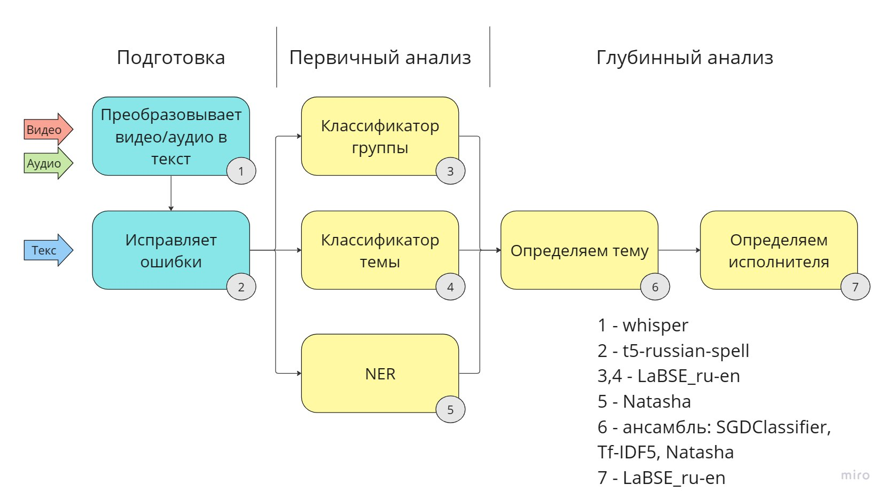

## Описание
Для автоматизации обработки обращений мы разработали решение основанное на ансамбле нейросетей. 
 
 
 
Уникальность решения: Может работать с видео, аудио и текстовыми сообщениями, группировать обращения в инциденты, автоматически определяет нужное ведомство и при попадании в нулевой класс бот может задавать уточняющие вопросы 
 
 
 
Технологии: FastAPI, Docker - для каркаса решения, модели для классификации и распознавания информации

## Схема работы

ИТОГОВЫЕ ВЕРСИИ МОДЕЛИ:
1) Предсказание Исполнителя: https://drive.google.com/file/d/1Ilvt-mq3C8fW8la2iMcuoCYu35Xu0Fjl/view
2) Предсказание Группы тем: https://drive.google.com/drive/folders/11DleA6bBUpUW3CRkVw4hKZJ-z6lR7-YS?usp=sharing
3) Предсказание Темы: https://drive.google.com/file/d/1fbMygBAYLOUgvybxF2LLfFTX2k-9MpAc/view?usp=sharing
